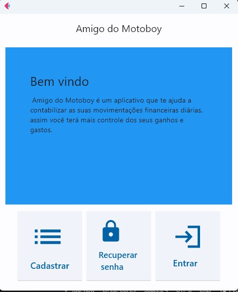
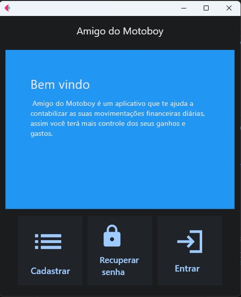

# Amigo do Motoboy

**Amigo do Motoboy** é um aplicativo que ajuda motoboys a controlar suas movimentações financeiras diárias. O aplicativo possui 12 páginas, onde o usuário pode adicionar seus ganhos e gastos para maior controle diário, semanal, mensal ou anual. Além disso, o aplicativo também mostra a previsão do tempo atualizada em tempo real, para que o motoboy possa se preparar para as condições climáticas.

## Requisitos

 - **Python 3.11 +**
 - **Flet**
 - **Flask**
 - **Pyodbc**
 - **Sql Server**
 - **OpenWeatherMap API**

**repositório:** https://github.com/cesar-augusto-ferreira/Amigo-do-Motoboy

## Funcionalidades

 - **Adicionar ganhos**
 - **Adicionar  gastos**
 - **Visualizar histórico de ganhos e gastos**
 - **Visualizar previsão do tempo**
 - **Controlar revisões e peças trocadas do veículo (Em breve)**
 - **Modo de Cores: Dark e Ligth**

## Tecnologia usada

O aplicativo foi desenvolvido com a linguagem python e foi usado a biblioteca Flet para desenvolver a interface gráfica.

**Python** é uma linguagem de programação de alto nível, conhecida por sua sintaxe limpa e fácil legibilidade. É uma das linguagens mais populares no mundo da tecnologia.

**Flet** é uma biblioteca Python voltada para o desenvolvimento de interfaces gráficas. Com o Flet, é possível criar aplicativos com interfaces intuitivas e visualmente atraentes.

## Imagens
- Imagen 1, Tela inical modo claro

- Imagen 1, Tela inical modo escuro

